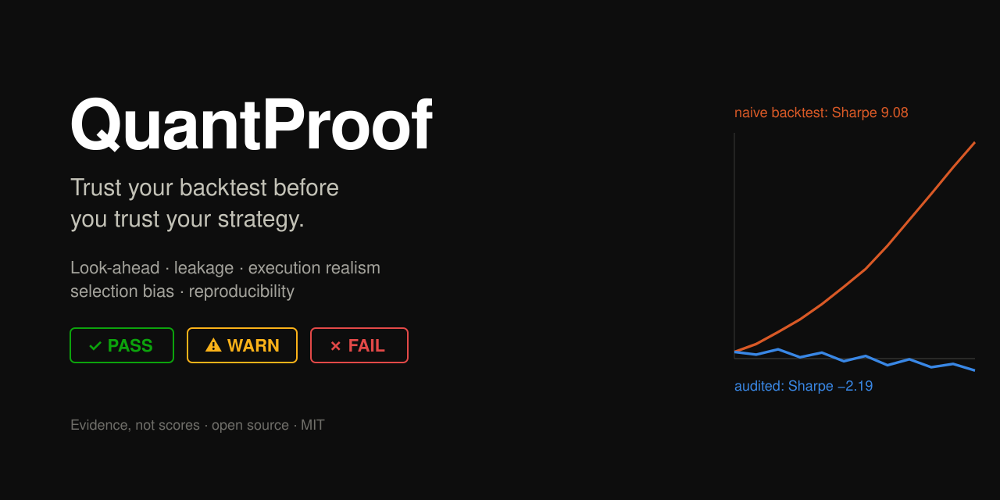
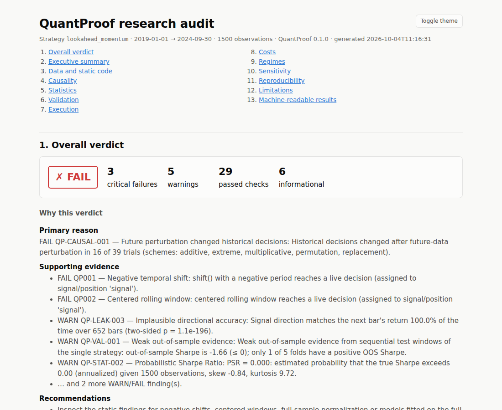

<p align="center"></p>

# QuantProof

**Trust your backtest before you trust your strategy.**

[](https://github.com/z33shxn/QuantProof/actions/workflows/tests.yml)
[](https://github.com/z33shxn/QuantProof/actions/workflows/lint.yml)
[](https://github.com/z33shxn/QuantProof/actions/workflows/build.yml)
[](pyproject.toml)
[](LICENSE)

QuantProof audits quantitative trading research. It is **not** a backtesting engine: it
sits on top of your research code or your backtester's output and produces evidence about
how far a result can be trusted.

```text
research code / backtester output  →  QuantProof  →  findings with evidence  →  PASS / WARN / FAIL
```

It looks for look-ahead bias, temporal leakage, random cross-validation on time series,
full-sample normalisation, target leakage, same-bar execution, missing costs, overfitting
and undeclared multiple testing, weak out-of-sample evidence, fragile parameter optima,
regime dependence and irreproducible experiments, in single-asset strategies and
multi-asset portfolios.

> A PASS means the checks that ran found no problem. It does **not** mean a strategy is
> profitable or will work live. See [what QuantProof cannot detect](docs/methodology/limitations.md).

---

## The problem in one example

`examples/lookahead_strategy/strategy.py` contains two common mistakes: "tomorrow's return"
computed with `shift(-1)`, and a centered rolling mean. A typical vectorized backtest of it
reports a Sharpe ratio of **9.08** and a CAGR of +225 %. QuantProof audits the same file:

```bash
quantproof audit -s examples/lookahead_strategy/strategy.py \
                 -d examples/data/prices.parquet -o audit-report.html
```

```text
  Naive (same-bar, no costs)   Sharpe   9.08   CAGR +225.0%   MaxDD    0.0%
  Audit (lag + costs)          Sharpe  -2.19   CAGR  -30.5%   MaxDD  -90.2%

STATIC ANALYSIS
✗ QP001         Negative temporal shift (examples/lookahead_strategy/strategy.py:20:27) [FORBIDDEN IN LIVE DECISION]
✗ QP002         Centered rolling window (examples/lookahead_strategy/strategy.py:21:13) [FORBIDDEN IN LIVE DECISION]
CAUSALITY
✗ QP-CAUSAL-001 Future perturbation changed historical decisions [FORBIDDEN IN LIVE DECISION]
    Historical decisions changed after future-data perturbation in 16 of 39 trials …
LEAKAGE
⚠ QP-LEAK-003   Implausible directional accuracy
    Signal direction matches the next bar's return 100.0% of the time over 652 bars …

WHY THIS VERDICT
  Primary reason: FAIL QP-CAUSAL-001 (Future perturbation changed historical decisions): …
  Next steps:
    1. Fix look-ahead first: while signals use future data, every performance, cost and
       overfitting statistic in this report is computed on contaminated returns.
    …
Critical failures: 3   Warnings: 5   Passed checks: 29
OVERALL: FAIL
```

(Output trimmed with `…`; every number is produced by the analysis.) The leak was found
three independent ways: in the **code** (AST data-flow analysis), in **behaviour**
(perturbing data after a decision changed that decision) and in the **numbers** (100 %
directional accuracy). The command exits with code 2 (FAIL), so it can gate CI.

The HTML report is self-contained (inline SVG, no CDN, works offline, light and dark
mode) and includes the narrative, every finding with why it matters / potential impact /
how to investigate, the statistics with their inputs, and a reproducibility footer:



A complete before/after story (a flawed first draft, the audit, the fix, the re-run)
is in [docs/examples/bad-research-workflow.md](docs/examples/bad-research-workflow.md)
and [good-research-workflow.md](docs/examples/good-research-workflow.md)
(`python examples/proof_of_value/run.py`).

---

## Installation

Python 3.10–3.13. Not yet on PyPI; install from GitHub:

```bash
pip install "quantproof[all] @ git+https://github.com/z33shxn/QuantProof.git@v0.1.0"
```

(drop `@v0.1.0` to install the latest `main`)

or from a clone (needed for the bundled examples):

```bash
git clone https://github.com/z33shxn/QuantProof.git
cd QuantProof
pip install -e ".[all]"     # [parquet] → pyarrow, [ml] → scikit-learn, [dev] → tooling
```

Runtime dependencies: NumPy, pandas, SciPy, Pydantic, Typer, Jinja2, PyYAML (and `tomli`
on Python 3.10). Parquet support and scikit-learn are optional.

## Quickstart (Python)

Works offline with seeded synthetic data:

```python
import numpy as np
import pandas as pd

from quantproof import AuditConfig, audit
from quantproof.data import generate_prices

prices = generate_prices(1500, seed=2026)  # synthetic OHLCV


def generate_signals(data: pd.DataFrame, fast: int = 20, slow: int = 100) -> pd.Series:
    """Target weight per bar, using only data up to and including that bar."""
    close = data["close"]
    fast_ma, slow_ma = close.rolling(fast).mean(), close.rolling(slow).mean()
    return pd.Series(np.where(fast_ma > slow_ma, 1.0, 0.0), index=data.index).where(slow_ma.notna())


result = audit(strategy=generate_signals, data=prices, config=AuditConfig(profile="quick"))

print(result.status)  # Severity.PASS / WARN / FAIL
print(result.narrative.primary_reason)  # the most important finding, in words
for finding in result.issues:  # WARN and FAIL findings
    print(finding.severity.value, finding.id, finding.title)
result.statistics["dsr"]  # DSR with trial provenance
result.execution["cost_attribution"]  # gross → each cost → net
result.reproducibility["fingerprints"]  # code / data / config / environment hashes
html = result.to_html()  # also to_markdown(), to_json()
```

More runnable examples: [docs/api/key-objects.md](docs/api/key-objects.md).

## Quickstart (command line)

```bash
quantproof generate-data prices.csv                        # synthetic data to try things on
quantproof audit -s my_strategy.py -d prices.csv -o report.html
quantproof audit -s my_strategy.py -d prices.csv --profile strict
quantproof audit -s my_strategy.py -d prices.csv --format markdown > AUDIT.md
quantproof audit --returns returns.csv --trials variants.csv   # any backtester's output
quantproof scan research/                                  # static analysis of a tree
quantproof validate prices.csv                             # data-quality checks only
quantproof statistics returns.csv --trials 200             # Sharpe / PSR / DSR / bootstrap
quantproof rules                                           # every rule id
quantproof rules show QP010                                # one rule's documentation
```

Exit codes: **0** pass, **1** warn, **2** fail, **3** invalid input, **4** internal error
(`--fail-on fail|never` relaxes 1/2; `--debug` shows tracebacks). Profiles: **quick**
(smaller resampling for iteration), **standard** (default), **strict** (larger resampling,
undeclared trial counts become a WARN). Details: [docs/api/cli.md](docs/api/cli.md),
[docs/api/configuration.md](docs/api/configuration.md).

## The strategy contract

A strategy file exposes one function; everything else is optional plain-literal metadata:

```python
NAME = "dual_ma_trend"
PARAMETERS = {"fast": 20, "slow": 100}  # defaults
PARAM_GRID = {"fast": [10, 20, 30, 40], "slow": [60, 100, 140, 180]}  # every variant tried
EXECUTION = {"signal_lag": 1, "commission_bps": 1.0, "spread_bps": 2.0, "slippage_bps": 2.0}


def generate_signals(data, fast=20, slow=100):
    """Target weight at each bar, decided with data up to and including that bar."""
```

- **Single asset**: `data` has a DatetimeIndex; return a Series of weights.
- **Multi-asset**: long-format data with a `symbol` column becomes a `(timestamp, symbol)`
  panel; return a timestamps × symbols DataFrame of portfolio weights. See
  [docs/methodology/multi-asset.md](docs/methodology/multi-asset.md) and
  `examples/cross_sectional_momentum/`.
- `PARAM_GRID` lets QuantProof measure selection bias (DSR, PBO, walk-forward and CPCV
  selection, Reality Check/SPA, parameter surface). `EXECUTION` lets it compare your
  assumptions with realistic ones.

Code not written against the contract can still be audited: `quantproof scan` for static
analysis, and results mode (`returns=`, `trial_returns=`, `ResearchArtifacts`,
`GenericResultsAdapter`) for everything that works on outputs.

## What QuantProof checks

| Area | Rules | How |
|---|---|---|
| Data quality | `QP-DATA-000…015` | timestamps (invalid, unsorted, duplicated, mixed timezones, gaps), OHLC consistency, non-positive / infinite / missing / stale prices, extreme returns, empty data, unsynchronised panel symbols |
| Static code analysis | `QP000–QP015` | AST analysis at three documented [analysis levels](docs/methodology/lookahead-detection.md#analysis-levels) (local patterns, symbol resolution, intra-file data flow through helper functions); usage-aware severities: *FORBIDDEN IN LIVE DECISION* vs *LEGITIMATE FOR LABEL / ANALYSIS* |
| Runtime causality | `QP-CAUSAL-001…004` | re-run the strategy with data strictly after a decision time perturbed (additive, multiplicative, permutation, replacement, extreme); decisions at or before that time must not change. Evidence: decision time, first modified observation, original vs perturbed value |
| Leakage (values) | `QP-LEAK-001…003` | features replicating the target or future returns; implausible (two-sided) directional accuracy |
| Execution realism | `QP-EXEC-001…006` | naive vs declared vs realistic fills, lag sensitivity, cost attribution (gross → commission, spread, slippage, impact, taxes → net), cost multipliers 0×–3×, break-even, turnover, trade timestamps, untestable execution styles |
| Statistics | `QP-STAT-001…007` | sample size, PSR, DSR (exact expected maximum, trial provenance, effective-trials estimate), implausible Sharpe, undeclared trials, non-normality, serial correlation |
| Validation / selection | `QP-VAL-001…004` | out-of-sample evidence (positive folds, dispersion, IS→OOS ratio; no composite score), PBO (CSCV), CPCV paths, White Reality Check / Hansen SPA |
| Regimes, sensitivity | `QP-REGIME-001`, `QP-SENS-001…002` | volatility / drawdown / bull-bear regimes; plateau vs fragile optimum, IS/OOS rank persistence |
| Reproducibility | manifest | separate code, data, config, parameter and environment fingerprints; Git commit; seed; lineage |

Every rule's severity policy, rationale, limitations and an example are in the generated
[rule catalogue](docs/api/rules.md) (`quantproof rules --json` for machines).

## Statistical methods

Implemented with NumPy/SciPy, documented with their null hypotheses, assumptions and what
they do **not** show, and tested against closed forms, independent naive implementations,
recorded reference values or Monte Carlo calibration:

- **Sharpe ratio** (scale-normalised computation, non-normal standard error, Lo 2002 adjustment)
- **Probabilistic Sharpe Ratio** and **Minimum Track Record Length** (Bailey & López de Prado 2012)
- **Deflated Sharpe Ratio** (Bailey & López de Prado 2014) with the exact expected maximum of N trials (the paper's closed form is −7.9 % off at N = 2) and a Li & Ji (2005) effective-trials estimate
- **Probability of Backtest Overfitting** via CSCV (Bailey et al. 2017), checked against a naive reference
- **White's Reality Check** (2000) and **Hansen's SPA** (2005) with the stationary bootstrap
- **Bootstrap**: i.i.d., moving-block, circular-block, stationary; Politis–White block length (matches `arch` reference values)
- **Temporal validation**: walk-forward, purged K-fold and CPCV with sample-time or event-time labels (`event_end`/`event_start`), embargo by fraction, bars or duration; exact boundary tests and brute-force references

Methodology: [docs/methodology/](docs/methodology/README.md) · Sources:
[docs/references.md](docs/references.md).

## Architecture

```text
src/quantproof/
├── engine.py         audit(): orchestration of every analyzer
├── results.py        AuditResult, Finding, narrative, verdict rules
├── rules.py          rule registry (single source of truth for ids and documentation)
├── analyzers/
│   ├── static/       AST analyzer + rules QP001–QP015 (pluggable via @register)
│   ├── causal/       perturbation schemes and runner
│   ├── leakage/      value-based leakage diagnostics
│   ├── execution/    execution-realism analyzer
│   └── statistical/  statistics + selection-bias analyzers
├── statistics/       Sharpe, PSR, DSR, PBO, Reality Check/SPA, bootstrap
├── validation/       walk-forward, purging, embargo, purged K-fold, CPCV
├── execution/        cost components, fills, simulator (single asset + portfolio), turnover
├── data/             loaders, panels, validation, synthetic data
├── regimes/, sensitivity/, experiments/ (hashing, manifest, lineage)
├── reports/          HTML, Markdown, JSON, text
├── adapters/         ResearchArtifacts, PandasAdapter, GenericResultsAdapter
├── strategy.py       strategy contract and loader
├── config.py         AuditConfig and profiles
└── cli.py            `quantproof` command
```

The verdict is not a score. It follows three explicit rules: **FAIL** if any finding is
FAIL (a research-validity violation), **WARN** if no FAIL but at least one WARN, **PASS**
otherwise. The narrative picks the primary reason by severity, live-decision usage and
category (look-ahead before execution before statistics).

## Integrations

The core never imports a backtesting engine. Any engine's output becomes
`ResearchArtifacts`; `GenericResultsAdapter` maps a returns/equity export and a trade
ledger by column name. QuantProof ships **no** VectorBT, Backtrader or LEAN adapter;
[docs/api/adapters.md](docs/api/adapters.md) explains what to export from each.

## Examples

| Example | What is wrong | What QuantProof reports |
|---|---|---|
| [`clean_strategy`](examples/clean_strategy/strategy.py) | nothing structural | no static, causality, leakage or execution issues; **WARN** only because the evidence for an edge is weak (it loses money on this synthetic data) |
| [`lookahead_strategy`](examples/lookahead_strategy/strategy.py) | `shift(-1)`, centered window | **FAIL**: QP001, QP002, QP-CAUSAL-001; WARN QP-LEAK-003, QP-STAT-004 |
| [`leakage_strategy`](examples/leakage_strategy/strategy.py) | global scaler, shuffled split, forward return in features | **FAIL**: QP001, QP006, QP012, QP-CAUSAL-001; WARN QP004 |
| [`overfit_strategy`](examples/overfit_strategy/strategy.py) | best of 240 rules on a random walk | **WARN**: QP013, DSR 0.18, PBO 0.60, walk-forward OOS Sharpe −0.60, CPCV, SPA, fragile optimum |
| [`unrealistic_execution`](examples/unrealistic_execution/strategy.py) | same-bar fills, zero costs | **FAIL**: QP-EXEC-001 (Sharpe 1.64 → 0.10 under audit assumptions); WARN QP009, QP011, cost fragility |
| [`cross_sectional_momentum`](examples/cross_sectional_momentum/strategy.py) | nothing structural; 36 variants declared | **WARN**: weak out-of-sample evidence, PBO ≈ 0.8, DSR ≈ 0.5. The honest result for a noisy edge |
| [`proof_of_value`](examples/proof_of_value/run.py) | flawed draft → fix | FAIL (QP002, QP-CAUSAL-001, same-bar fills, no costs) → WARN after the fix |

Run them with `python examples/run_examples.py`; details in
[docs/examples/README.md](docs/examples/README.md). All bundled data is synthetic.

## Limitations

The main ones (full list: [docs/methodology/limitations.md](docs/methodology/limitations.md)):

- Static analysis is heuristic and intra-file; the runtime test is evidence for the tested
  timestamps and schemes, not proof. Neither can see leakage already in the data
  (survivorship, restatements, wrong availability timestamps).
- The reference simulator uses bar prices; intrabar, event-driven, VWAP/TWAP execution is
  reported as untestable rather than simulated.
- Selection-bias statistics only account for variants you declare.
- **Strategy code runs in your Python process without a sandbox.** Only audit code you
  trust. See [SECURITY.md](SECURITY.md).

## Development

```bash
pip install -e ".[dev]"
pytest                                   # unit, integration, property-based tests and doctests
ruff check . && ruff format --check .
mypy                                     # strict typing of the library
python -m build && twine check dist/*
python benchmarks/bench.py               # informational timings
```

See [CONTRIBUTING.md](CONTRIBUTING.md) for adding rules, adapters and cost providers,
[ROADMAP.md](ROADMAP.md) for planned work and [CHANGELOG.md](CHANGELOG.md) for changes.

## License

MIT. See [LICENSE](LICENSE). All bundled data is synthetic.
